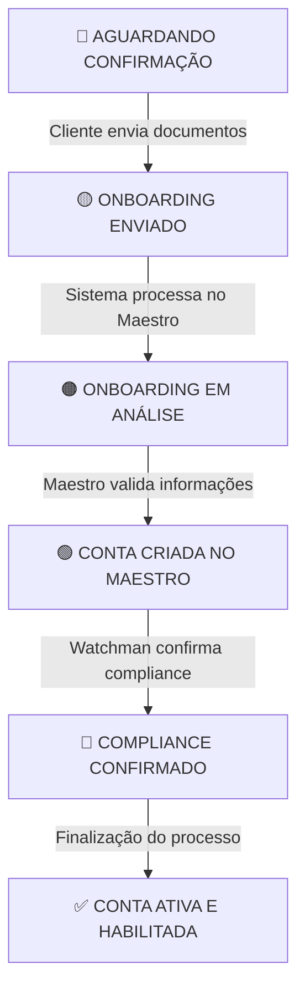

# 🧠 Visão Geral

O **Assemble** é uma plataforma de **Banking as a Service (BaaS)** que permite que parceiros integrem serviços bancários de forma rápida e eficiente em suas próprias aplicações.

> "Construa produtos financeiros robustos sem reinventar a infraestrutura bancária."

Atualmente, oferecemos um sistema completo de gestão de usuários, permissões, onboarding e abertura de contas para pessoas físicas. No futuro, também abriremos nossa tecnologia para instituições que já possuam licença bancária e desejem utilizar apenas a nossa infraestrutura tecnológica.

---

## 🎯 Motivação

### Problemas que Resolvem

- **Barreira de entrada alta** para empresas que querem oferecer serviços bancários
- **Complexidade regulatória** na criação de produtos financeiros
- **Tempo de desenvolvimento elevado** para infraestrutura bancária
- **Necessidade de expertise técnica** específica em serviços financeiros

### Oportunidades

- 🚀 **Acelerar o time-to-market** de produtos financeiros para parceiros
- 🌍 **Democratizar o acesso** a serviços bancários digitais
- 🤝 **Criar um ecossistema** de parceiros focados em suas especialidades
- 💸 **Reduzir custos** operacionais de desenvolvimento e manutenção

---

## 🚀 Impacto no Produto

### Para Nossos Parceiros

- ⚡ **Velocidade:** Redução de meses para semanas no lançamento de produtos bancários
- 🔐 **Segurança:** Sistema robusto de autenticação e autorização já testado e aprovado
- 📈 **Escalabilidade:** Infraestrutura que cresce conforme a demanda do parceiro
- 🎯 **Foco:** Parceiros podem focar em sua experiência única ao invés de infraestrutura

### Para Usuários Finais (Clientes dos Parceiros)

- ✨ **Experiência Fluida:** Processo de onboarding otimizado
- 🛡️ **Confiabilidade:** Operações bancárias seguras e monitoradas 24/7
- 🚀 **Rapidez:** Criação de contas e processos bancários em tempo real

---

## 🛠️ Capacidades Técnicas Entregues

- **Sistema de Permissões Granular:** Controle fino sobre quem pode fazer o quê
- **Gestão Multi-Partner:** Múltiplos parceiros operando de forma isolada e segura
- **Onboarding Automatizado:** Processo de cadastro e validação de clientes
- **APIs RESTful:** Integração simples e padronizada

---

# 🏗️ Arquitetura da Solução

## Componentes Principais

1. **Gestão de Parceiros**
   - Cadastro e configuração de parceiros
   - Geração de chaves de API para acesso seguro
   - Isolamento de dados entre parceiros
2. **Sistema de Usuários**
   - Usuários de Sistema: Operadores dos parceiros
   - Usuários Bancários: Clientes finais dos produtos bancários
   - Grupos e Permissões: Controle granular de acesso
3. **Processo de Onboarding**
   - Fluxo personalizável de cadastro
   - Validação de documentos automatizada
   - Integração com sistemas externos (Maestro, Watchman)
4. **Segurança e Compliance**
   - Autenticação multi-camada
   - Auditoria completa de ações
   - Constraints e validações de negócio

---

# 📊 Fluxos de Negócio

## Fluxo de Configuração Inicial (Baseline)

1. **Admin Interno cria parceiro no sistema**
2. **Parceiro recebe credenciais de acesso**
3. **Parceiro testa integração em ambiente sandbox**
4. **Go-live em produção**

## Fluxo de Onboarding de Cliente

1. **Cliente inicia cadastro na aplicação do parceiro**
2. **Sistema coleta dados e documentos necessários**
3. **Validação automatizada de informações**
4. **Análise de risco e compliance**
5. **Criação da conta bancária**
6. **Cliente pode usar serviços bancários**

---

## 🔄 Fluxos Detalhados de Negócio

### 🚀 Fluxo de Configuração de Novo Parceiro

| Etapa                                  | Responsável                    | Resultado                                        | O que acontece                                                                  |
| -------------------------------------- | ------------------------------ | ------------------------------------------------ | ------------------------------------------------------------------------------- |
| Cadastro do Parceiro no Sistema        | Equipe interna (Azify)         | Parceiro criado com credenciais de integração    | Criação do perfil, integrações com Maestro/Watchman, geração de identificadores |
| Geração de Credenciais de Acesso       | Equipe interna (Azify)         | Chave de API exclusiva do parceiro               | Criação de chave, permissões iniciais, ativação do ambiente                     |
| Configuração do Usuário Administrativo | Parceiro (com suporte interno) | Administrador do parceiro pode acessar o sistema | Criação do usuário, grupo e credenciais                                         |
| Validação e Testes Iniciais            | Parceiro                       | Integração validada e funcionando                | Testes de autenticação, permissões e isolamento de dados                        |

### 👤 Fluxo de Onboarding de Cliente Final

#### Estados do Processo de Onboarding

#### Jornada do Cliente

1. **Início do Cadastro:** Cliente preenche dados básicos na aplicação do parceiro
2. **Envio de Documentos:** Upload de documentos e selfie para validação biométrica
3. **Análise Automatizada:** Validação de dados, compliance e checagem de listas restritivas
4. **Criação da Conta Bancária:** Geração de número de conta e ativação de funcionalidades
5. **Liberação para Uso:** Cliente recebe confirmação e acesso às funcionalidades bancárias

---

# 🔐 Sistema de Permissões

A plataforma opera com **4 níveis de segurança** que garantem que cada usuário acesse apenas o que deve:

## Nível 1: Permissões Básicas (O que você PODE fazer)

- **Super Administradores (Wisiex):** Acesso total à plataforma
- **Administradores de Parceiro:** Gestão completa dentro do seu parceiro
- **Clientes Finais:** Apenas suas próprias informações e operações

## Nível 2: Restrições de Compliance (O que você DEVE cumprir)

- Validações automáticas baseadas em regulamentações
- Controles específicos por tipo de operação
- Auditoria completa de todas as ações

### Exemplo Prático - Criação de Cliente

| Ação                                  | Administrador do Parceiro | Cliente Final |
| ------------------------------------- | :-----------------------: | :-----------: |
| Criar novos clientes                  |            ✅             |      ❌       |
| Ver lista de clientes do seu parceiro |            ✅             |      ❌       |
| Editar informações de clientes        |            ✅             |      ❌       |
| Ver clientes de outros parceiros      |            ❌             |      ❌       |
| Alterar configurações da plataforma   |            ❌             |      ❌       |
| Ver suas próprias informações         |            ❌             |      ✅       |
| Atualizar dados pessoais              |            ❌             |      ✅       |
| Consultar histórico de transações     |            ❌             |      ✅       |
| Realizar operações administrativas    |            ❌             |      ❌       |

---

# 👥 Tipos de Usuário e Capacidades

## 🔴 Super Administrador (Equipe Wisiex)

- Criar e gerenciar parceiros
- Configurar permissões globais
- Monitorar performance da plataforma
- Resolver problemas técnicos

## 🟡 Administrador de Parceiro

- Criar e gerenciar usuários do parceiro
- Configurar grupos e permissões internas
- Acompanhar métricas de onboarding
- Gerenciar configurações de produtos

## 🟢 Cliente Final

- Consultar saldo e extratos
- Realizar transferências
- Atualizar dados pessoais
- Acessar produtos financeiros

---

# ⏱️ Tempos de Processo - SLA Esperados

| Processo                 | Tempo Médio | Tempo Máximo | Observações              |
| ------------------------ | ----------- | ------------ | ------------------------ |
| Configuração de Parceiro | 1 hora      | 4 horas      | Inclui testes iniciais   |
| Onboarding PF (Simples)  | 5 minutos   | 30 minutos   | Documentos em ordem      |
| Onboarding PJ (Complexo) | 2 horas     | 24 horas     | Depende de validações    |
| Criação de Usuário       | Instantâneo | 1 minuto     | Após onboarding completo |
| Ativação de Conta        | Instantâneo | 5 minutos    | Após aprovação final     |

---

# ⚠️ Riscos e Limitações

## Riscos Identificados

- **Dependência de Integrações Externas:** Maestro e Watchman são críticos para operação
- **Complexidade Regulatória:** Mudanças em regulamentações podem impactar funcionalidades
- **Escalabilidade de Suporte:** Crescimento rápido de parceiros pode sobrecarregar suporte técnico
- **Segurança de Dados:** Alto volume de dados sensíveis requer monitoramento constante

## Limitações Atuais

- **Customização de UI:** Parceiros dependem de APIs, precisam desenvolver suas próprias interfaces
- **Relatórios:** Sistema básico de relatórios, pode necessitar ferramentas externas para analytics avançados
- **Workflows Complexos:** Alguns processos bancários específicos podem precisar desenvolvimento customizado

## Pontos de Atenção

- **Onboarding de Parceiros:** Processo manual que pode se tornar gargalo
- **Documentação:** Manter documentação atualizada conforme evoluções da API
- **Versionamento:** Gerenciar compatibilidade entre versões da API
