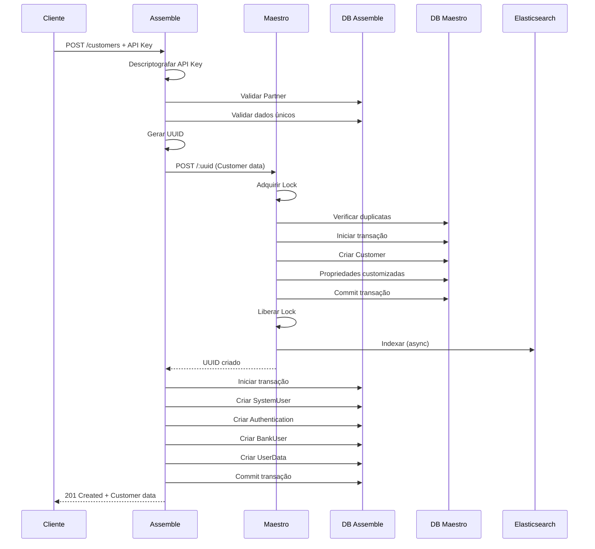

# Fluxo de Criação de Customer - Visão Unificada

Este documento descreve o fluxo completo de criação de um Customer no ecossistema, desde a requisição HTTP inicial até a sincronização final no Elasticsearch, passando pelos sistemas Assemble e Maestro.

## Visão Geral

O processo de criação de Customer é uma operação complexa através de múltiplos sistemas:

- **Sistema Assemble** (NestJS): Gateway de entrada, autenticação e validações iniciais
- **Sistema Maestro** (Node.js): Core bancário, persistência e processamento avançado
- **Elasticsearch**: Sistema de busca e indexação para consultas rápidas

O fluxo garante **atomicidade**, **consistência**, **observabilidade** e **escalabilidade** através de transações distribuídas, locks de concorrência e processamento assíncrono.

## Arquitetura do Fluxo

```
Cliente → Assemble (Gateway) → Maestro (Core) → Elasticsearch (Indexação)
   ↑                                ↓
   └──────── Resposta ←─────────────┘
```

## Fluxo Detalhado de Ponta a Ponta

### Fase 1: Entrada e Autenticação (Sistema Assemble)

#### 1.1 Recepção da Requisição (`CustomersController`)

**Endpoint**: `POST /customers`

- Recebe requisição HTTP com dados do customer (`CustomersCreateDto`)
- Aplica guard de autenticação (`PartnerApiKeyGuard`)
- Extrai informações do partner autenticado via decorator `@CurrentPartner`
- Delega processamento para `CustomersService.create()`

#### 1.2 Autenticação e Autorização (`PartnerApiKeyGuard`)

**Responsabilidades**:

- Extrai API key do header `x-api-key`
- Descriptografa API key usando `AesService` (AES-256-GCM)
- Busca partner correspondente no banco de dados
- Valida se partner está ativo (não soft deleted)
- Injeta informações do partner (`PartnerInfo`) na requisição

### Fase 2: Validações e Preparação (Sistema Assemble)

#### 2.1 Validações Iniciais (`CustomersService.create()`)

- **Validação de Acesso ao Grupo**: Verifica se o grupo especificado existe e pertence ao partner
- **Validação de Unicidade**: Verifica se email, telefone ou username já existem para o para um customer de um partner
- **Validação de Dados**: Aplica regras de negócio e formatação

#### 2.2 Preparação de Dados

- Gera UUID único para o customer
- Constrói DTO para criação de usuário bancário (`CreateBankUserDto`)
- Prepara payload para integração com Maestro

### Fase 3: Integração com Core Bancário (Assemble → Maestro)

#### 3.1 Chamada para Maestro (`MaestroService.createCustomer()`)

**Integração Externa**:

- Realiza chamada HTTP para API Maestro: `POST /:id`
- Autentica usando credenciais Basic Auth do partner
- Envia UUID gerado e dados do customer
- Configura permissões padrão (cashin, cashout, etc.)
- Define tipo de customer (individual/corporate)

### Fase 4: Processamento no Core (Sistema Maestro)

#### 4.1 Roteamento e Controller (`src/controllers/baas/customers/`)

**Camada de Roteamento**:

- **Rota**: `POST /:id`
- **Middleware**: Wrapper `r()` para tratamento de erros
- **Controller**: `createCustomer.js` processa requisição

**Responsabilidades do Controller**:

- Recebe UUID do customer e dados no body
- Cria contexto REST (`makeRestContext`)
- Extrai parâmetros e delega para serviço
- Retorna resposta HTTP `201 CREATED`

#### 4.2 Validações e Controle de Acesso (`src/services/customer/createCustomer.js`)

**Validações Iniciais**:

- **Controle de Acesso**: Verifica permissões de escrita (`requireWriteAccess`)
- **Validação de Dados**: Parseia payload usando schema `customerDTO`
- **Extração de Contexto**: Obtém `partnerId` do contexto

#### 4.3 Controle de Concorrência

**Lock Distribuído**:

- Adquire lock exclusivo: `create-customer-${partnerId}-${uuid}`
- **Prevenção de Duplicatas**: Verifica se UUID já existe
- **Tratamento Configurável**: `reportDuplicated()` com comportamento via feature flag
- **Monitoramento**: Alertas para locks longos (>10s)

#### 4.4 Transação Principal

**Persistência Atômica**:

- Cria transação nomeada para rastreabilidade
- Insere registro principal na tabela `Customer`
- **Processamento de Propriedades Customizadas**:
  - Busca metadados disponíveis para o partner
  - Mapeamento flexível por `name`, `slug` ou `uuid`
  - Persistência em `CustomerPropertiesValue`
  - Configurações em `TransactionalSetting`

### Fase 5: Persistência Distribuída (Assemble + Maestro)

#### 5.1 Transação no Assemble

Executa transação no banco de dados Assemble incluindo:

- **Criação de System User**: Usuário base do sistema
- **Criação de Autenticação**: Hash da senha (bcrypt, salt rounds: 10)
- **Criação de Bank User**: Usuário bancário vinculado ao partner
- **Criação de User Data**: Dados específicos do customer

#### 5.2 Finalização no Maestro

**Commit e Pós-Processamento**:

- Confirma transação no banco Maestro
- Remove lock distribuído
- **Auditoria**: Registra evento com contexto completo
- **Sincronização**: Dispara indexação no Elasticsearch
- Retorna UUID do customer criado

### Fase 6: Indexação e Sincronização (Elasticsearch)

#### 6.1 Processamento Assíncrono (`ElasticSync/index.ts`)

**Características**:

- **Job Queue**: Processamento em background sem bloquear resposta
- **Transformação**: Adaptação de dados para formato de busca
- **Relacionamentos**: Inclusão de dados relacionados
- **Resiliência**: Tratamento independente de erros

### Fase 7: Construção da Resposta

#### 7.1 Resposta Unificada

- Maestro retorna UUID para Assemble
- Assemble monta `CustomersCreateResponseDto` com:
  - Dados do customer criado
  - UUID gerado
  - Timestamp de criação
- Resposta HTTP `201 CREATED` para o cliente

## Componentes e Tecnologias Envolvidas

### Sistemas Principais

| Sistema           | Tecnologia           | Responsabilidade                           |
| ----------------- | -------------------- | ------------------------------------------ |
| **Assemble**      | NestJS + TypeScript  | Gateway, autenticação, validações iniciais |
| **Maestro**       | Node.js + JavaScript | Core bancário, persistência, processamento |
| **Elasticsearch** | ES + TypeScript      | Indexação, busca e consultas rápidas       |

### Entidades de Dados

#### Entrada (Cliente → Assemble)

- `CustomersCreateDto`: Dados do customer a ser criado
- `x-api-key`: Chave de autenticação do partner

#### Processamento (Assemble)

- `PartnerInfo`: Informações do partner autenticado
- `SystemUser`: Usuário base do sistema
- `Authentication`: Credenciais hasheadas
- `BankUser`: Usuário bancário vinculado ao partner
- `UserData`: Dados específicos do customer

#### Processamento (Maestro)

- `Customer`: Registro principal no core bancário
- `CustomerPropertiesValue`: Propriedades customizadas
- `TransactionalSetting`: Configurações transacionais
- Contexto de auditoria e logs

#### Saída (Assemble → Cliente)

- `CustomersCreateResponseDto`: Dados do customer criado com UUID e timestamp

### Componentes de Infraestrutura

#### Sistema de Segurança

- **AES Service**: Criptografia AES-256-GCM para API keys
- **bcrypt**: Hash de senhas com salt rounds: 10
- **PartnerApiKeyGuard**: Autenticação e autorização
- **Ownership Validation**: Partner só acessa seus recursos

#### Sistema de Concorrência

- **Lock Distribuído** (`acquireLock.js`): Prevenção de condições de corrida
- **Padrão de Lock**: `create-customer-${partnerId}-${uuid}`
- **Monitoramento**: Alertas para locks longos (>10s)
- **Debug**: Stack trace para diagnóstico

#### Sistema de Transações

- **Transações Nomeadas**: Rastreabilidade e debug
- **Safe Rollback** (`safeRollback.js`): Rollback protegido
- **Atomicidade**: Garantia de consistência entre sistemas
- **Cleanup**: Limpeza automática de recursos

#### Sistema de Auditoria

- **AuditLogger** (`AuditLogger.ts`): Log completo de mudanças
- **Contexto Rico**: IP, User-Agent, correlationId
- **Estados**: Captura estado anterior e novo
- **Relacionamentos**: Links entre entidades

#### Sistema de Sincronização

- **ElasticSync** (`ElasticSync/index.ts`): Indexação assíncrona
- **Job Queue**: Processamento em background
- **Transformação**: Adaptação para formato de busca
- **Retry Logic**: Reprocessamento em caso de falha

## Características Arquiteturais

### Garantias de Consistência

- **Atomicidade**: Transações distribuídas garantem integridade entre Assemble e Maestro
- **Isolamento**: Locks distribuídos previnem condições de corrida
- **Durabilidade**: Commit explícito assegura persistência em ambos os sistemas
- **Consistência**: Validações em múltiplas camadas garantem integridade dos dados

### Observabilidade e Monitoramento

- **Auditoria Completa**: Todos os eventos registrados com contexto rico
- **Métricas**: Monitoramento de transações e locks longos
- **Debugging**: Stack traces e logs detalhados
- **Rastreabilidade**: Correlation IDs através de todo o fluxo

### Escalabilidade e Performance

- **Processamento Assíncrono**: Elasticsearch sync não bloqueia resposta
- **Locks Granulares**: Bloqueio específico por partner/UUID
- **Job Queue**: ElasticSync processa em background
- **Transações Otimizadas**: Commit rápido para liberar recursos

### Flexibilidade e Configurabilidade

- **Propriedades Dinâmicas**: Sistema de metadados customizáveis
- **Feature Flags**: Comportamentos ajustáveis via configuração
- **Multi-tenant**: Isolamento completo por partner
- **Mapeamento Flexível**: Identificação por name, slug ou UUID

## Tratamento de Erros e Recuperação

### Cenários de Falha

#### Camada Assemble

1. **API Key Inválida**: Retorna `401 Unauthorized`
2. **Grupo Não Encontrado**: Retorna `401 Unauthorized`
3. **Dados Duplicados**: Retorna `401 Unauthorized`
4. **Falha na Integração**: Tratamento via `handleHttpClientError`
5. **Erro de Transação**: Rollback automático

#### Camada Maestro

1. **Duplicata de UUID**: Tratamento configurável via feature flag
2. **Falha de Transação**: Rollback automático e liberação de lock
3. **Timeout de Lock**: Alertas e monitoramento ativo
4. **Erro de Validação**: Retorna `400 Bad Request`

#### Camada Elasticsearch

1. **Erro de Sincronização**: Não afeta consistência do banco principal
2. **Falha de Indexação**: Jobs podem ser reprocessados
3. **Timeout de Job**: Retry automático configurável

### Estratégias de Recuperação

- **Transações Nomeadas**: Facilita identificação de problemas
- **Rollback Seguro**: Prevenção de estados inconsistentes
- **Retry Logic**: Reprocessamento automático de jobs
- **Monitoramento Ativo**: Alertas proativos para operações longas
- **Circuit Breaker**: Proteção contra cascata de falhas

## Respostas da API

### Sucesso (201 Created)

```json
{ "id": "94fe129c-4724-11f0-9d81-42af4b4e1752", "email": "johndoe@email.com", "fullName": "John Doe", "phoneNumber": "+5585999999995", "taxpayer": "24824548080", "type": "CORPORATE", "username": "johndoe", "createdAt": "2025-06-12T00:31:29.322Z" }
```

### Erros Comuns

#### Autenticação (401 Unauthorized)

```json
{
  "statusCode": 401,
  "message": "Invalid API key",
  "error": "Unauthorized"
}
```

#### Dados Duplicados (401 Unauthorized)

```json
{
  "statusCode": 401,
  "message": "Email already exists for this partner",
  "error": "Unauthorized"
}
```

#### Validação (400 Bad Request)

```json
{
  "statusCode": 400,
  "message": ["email must be a valid email"],
  "error": "Bad Request"
}
```

#### Conflito Maestro (409 Conflict)

```json
{
  "error": "E_CUSTOMER_UUID_ALREADY_EXISTS",
  "message": "Customer UUID already exists"
}
```

## Diagrama de Sequência Completo



## Fluxo de Sucesso Simplificado

```
Cliente → Assemble (Auth + Validação) → Maestro (Core + Lock) → Elasticsearch (Async)
   ↑                                                                         ↓
   └─── Resposta 201 ←── Transação Assemble ←── UUID Retornado ←─────────────┘
```

## Considerações de Implementação

### Dependências e Tecnologias

- **Banco de Dados**: PostgreSQL via Prisma (Assemble) + DB proprietário (Maestro)
- **Criptografia**: AES-256-GCM para API keys, bcrypt para senhas
- **HTTP Client**: Para comunicação Assemble ↔ Maestro
- **Job Queue**: Para processamento assíncrono do Elasticsearch
- **Logging**: Winston/Similar para auditoria e debugging

### Configurações Importantes

- **Lock Timeout**: 10 segundos com alertas
- **Transaction Timeout**: Configurável por ambiente
- **Retry Policy**: 3 tentativas para jobs do Elasticsearch
- **Salt Rounds**: 10 para bcrypt
- **Feature Flags**: Comportamento de duplicatas configurável

### Monitoramento e Alertas

- **Métricas**: Tempo de resposta, taxa de erro, locks longos
- **Alertas**: Falhas de integração, timeouts, erros de transação
- **Dashboards**: Visibilidade em tempo real do fluxo
- **Health Checks**: Verificação contínua dos sistemas

## Conclusão

Este fluxo de criação de customer representa uma arquitetura robusta e escalável que:

1. **Garante Integridade**: Através de transações distribuídas e validações em múltiplas camadas
2. **Oferece Performance**: Com processamento assíncrono e locks granulares
3. **Provê Observabilidade**: Com auditoria completa e monitoramento ativo
4. **Mantém Flexibilidade**: Através de configurações dinâmicas e feature flags
5. **Assegura Segurança**: Com criptografia forte e validação de ownership

A solução balanceia consistência, performance e observabilidade, tornando-se uma base sólida para operações bancárias críticas.
