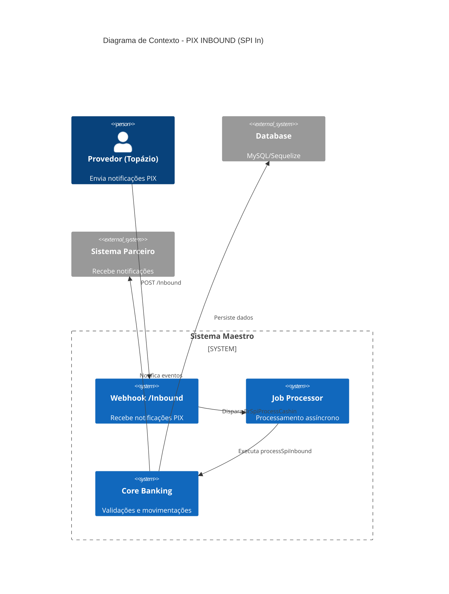
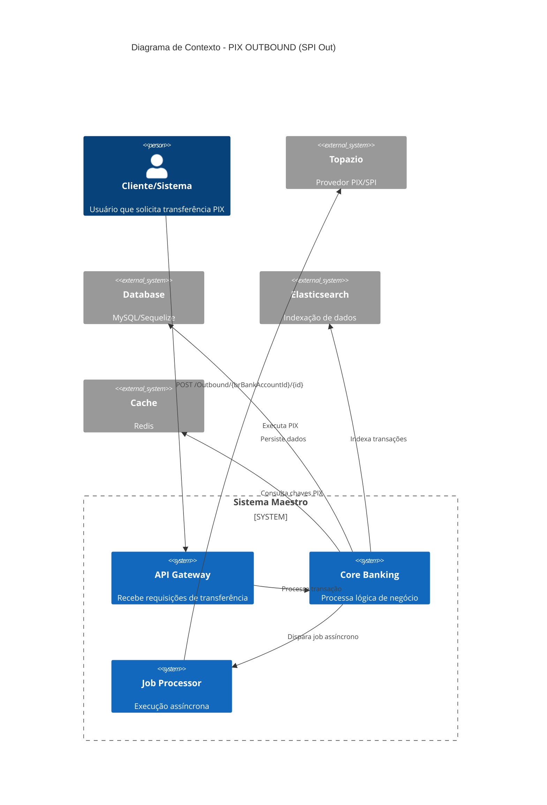
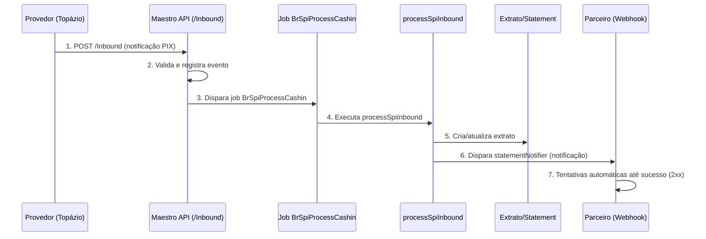
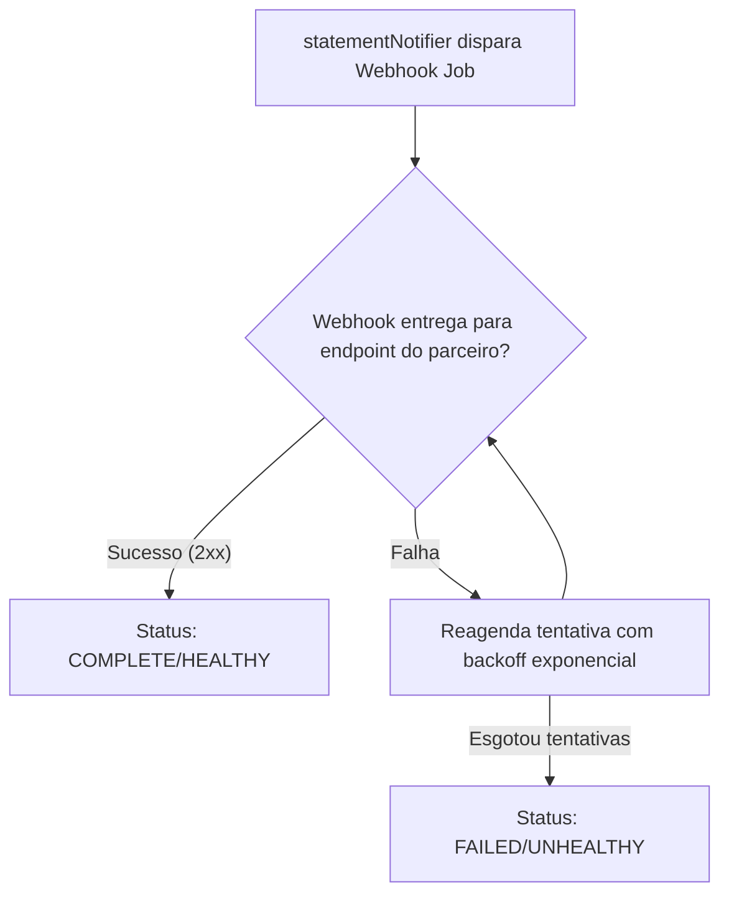
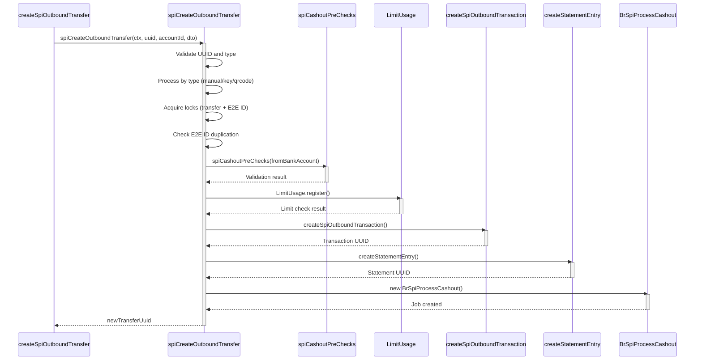
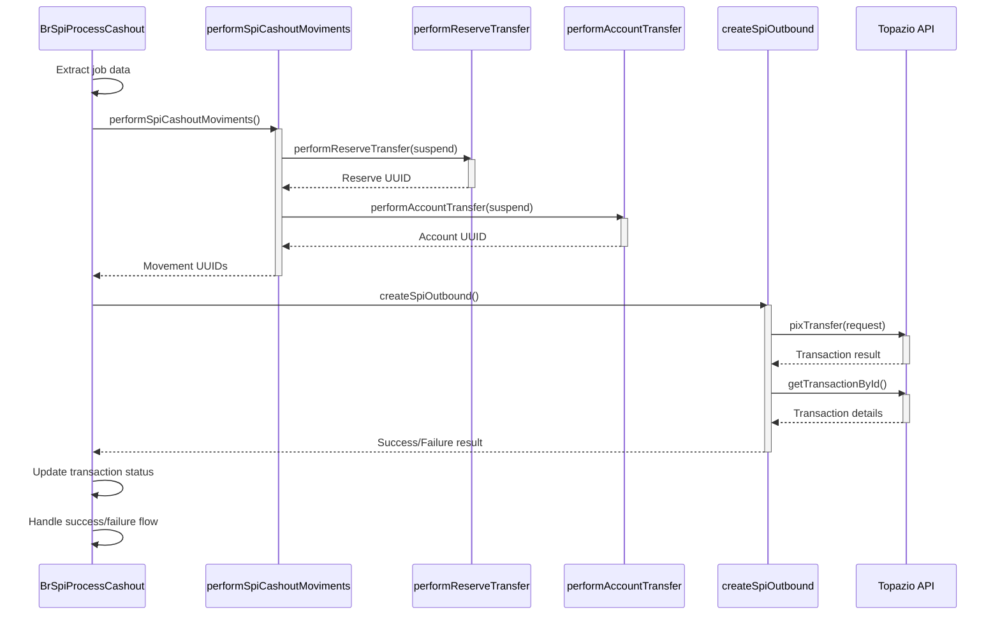
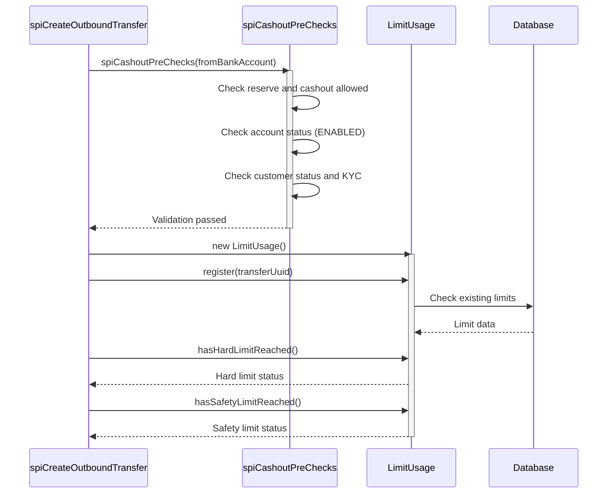

# Maestro
## 1. Visão Geral

Este documento unifica a documentação técnica dos fluxos PIX do sistema Maestro Backend, cobrindo tanto o processamento de transações de entrada (PIX INBOUND) quanto de saída (PIX OUTBOUND). Ambos os fluxos são fundamentais para o ecossistema de pagamentos instantâneos brasileiros e integram-se com o provedor Topázio através do Sistema de Pagamentos Instantâneos (SPI).

### PIX INBOUND (SPI In)

Responsável por processar eventos de entrada de transferências PIX recebidos via webhook do provedor. O objetivo é registrar, validar e liquidar a entrada de recursos, garantindo integridade, compliance e atualização dos saldos e extratos.

### PIX OUTBOUND (SPI Out)

Orquestra o processo completo de criação e processamento de uma transação PIX de saída, desde a requisição inicial até a execução efetiva do pagamento através do provedor Topázio. O sistema valida dados, verifica limites, cria registros transacionais, executa movimentações financeiras e coordena com APIs externas.

---

## 2. Arquitetura e Diagramas de Contexto

### 2.1 PIX INBOUND - Diagrama de Contexto



### 2.2 PIX OUTBOUND - Diagrama de Contexto



---

## 3. Fluxos Detalhados

### 3.1 PIX INBOUND - Entry Points e Processamento

#### A. Webhook HTTP: `/Inbound`

- **Arquivo:** routes.js
- **Rota:** `POST /Inbound`
- **Controller:** `spiInbound.js`
- **Service:** `spiInbound.js`

**Fluxo:**

1. **Recepção:** O endpoint `/Inbound` recebe notificações do provedor via HTTP POST.
2. **Controller:** A função `spiInbound(req, res, next)` monta um DTO e chama o service `Services.Br.Spi.Webhooks.Transactional.spiInbound`.
3. **Service:** A função `spiInbound(ctx, dto)`:
   - Gera um UUID para o evento.
   - Inicia o time tracking.
   - Salva o evento na tabela `br_spi_provider_events`.
   - Se não for um crédito válido, trata como chargeback e encerra.
   - Atualiza status para "processing".
   - Dispara o job `BrSpiProcessCashin` para processar o cashin de fato.
   - Finaliza o time tracking.

#### B. Job Assíncrono: `BrSpiProcessCashin`

- **Arquivo:** index.js
- **Job:** `brspiprocesscashin`
- **Service:** `processSpiInbound.js`

**Fluxo:**

1. O job é disparado pelo service do webhook.
2. Executa `processSpiInbound``(ctx, transactionId, e2eId, providerEventId)`.
3. **Processamento Detalhado:**
   - Valida se a transação já foi processada.
   - Busca e valida conta, cliente, programa, parceiro, moeda, limites, KYC, etc.
   - Cria registro em `BrSpiInboundTransaction`.
   - Cria lançamento de extrato.
   - Executa checagem AML.
   - Atualiza status para "processing".
   - Realiza movimentações financeiras (reserva e conta).
   - Atualiza status para "processed".
   - Atualiza extrato e notifica.
   - Em caso de erro, atualiza status e pode solicitar refund.

### 3.2 PIX OUTBOUND - Detalhamento do Fluxo

1. **Recepção da Requisição**: `POST /Outbound/{brBankAccountId}/{id}` é recebida pelo controller `createSpiOutboundTransfer`.

2. **Roteamento**: O controller delega para o service `spiCreateOutboundTransfer` através do framework de context.

3. **Validação Inicial**: O service valida o UUID da transferência, tipo de transação e valor.

4. **Processamento por Tipo**:

   - **Manual**: Gera End-to-End ID e sanitiza dados da conta destinatária
   - **Key**: Consulta cache com E2E ID e valida chave PIX. O sistema aceita os seguintes tipos de chave: CPF/CNPJ, Celular, E-mail e Chave Aleatória (EVP).
   - **QR Code**: Busca QR Code no banco e extrai dados do destinatário

5. **Aquisição de Locks**: Obtém locks para prevenção de duplicação (transferência + E2E ID).

6. **Validação de Duplicação**: Verifica se E2E ID já foi usado.

7. **Busca da Conta Origem**: Localiza conta bancária origem com includes de cliente, programa e conta.

8. **Pré-verificações**: Executa `spiCashoutPreChecks` para validar permissões e status.

9. **Controle de Limites**: Registra e valida limites através de `LimitUsage`.

10. **Criação da Transação**: Chama `createSpiOutboundTransaction` para persistir registro inicial.

11. **Criação do Extrato**: Gera entrada de extrato via `createStatementEntry`.

12. **Disparo do Job**: Cria job `BrSpiProcessCashout` para processamento assíncrono.

13. **Processamento Assíncrono**: O job executa movimentações financeiras via `performSpiCashoutMoviments`.

14. **Chamada ao Provedor**: Executa `createSpiOutbound` para efetuar transação no Topazio.

15. **Finalização**: Atualiza status e libera recursos conforme sucesso/falha.

---

## 4. Notificações e Reprocessamento

### 4.1 PIX INBOUND - Sistema de Notificação

#### Onde a notificação é disparada?

No final do processamento do SPI Inbound, em `processSpiInbound.js`:

```js
await updateStatementEntry(ctx, brSpiInboundTxUuid, 'complete');
await spiSetTransactionStatementEntry(ctx, brSpiInboundTxUuid, 'cashin');
await statementNotifier(ctx, brSpiInboundTxUuid); // ← Dispara a notificação
```

#### Como funciona o reprocessamento?

O arquivo statementNotifier.ts:

- Identifica o tipo de evento (ex: `PIX_CASHIN_RECEIVED`, `PIX_CASHIN_FAILED`, etc).
- Dispara o job `Webhook` com os dados do evento.

O arquivo index.js:

- Tenta enviar o evento para o(s) endpoint(s) do parceiro.
- Faz até 3 tentativas imediatas.
- Se falhar, agenda novas tentativas com backoff exponencial (até 11 tentativas).
- Para de tentar ao receber resposta 2xx (sucesso) ou após esgotar as tentativas.
- Atualiza o status do webhook para `HEALTHY` (sucesso) ou `UNHEALTHY` (falha).

#### Estados do Webhook

- **EXECUTING**: Tentativa em andamento
- **COMPLETE**: Sucesso (recebeu 2xx)
- **ONHOLD**: Aguardando próxima tentativa
- **FAILED**: Falhou definitivamente após todas as tentativas

---

## 5. Mapeamento de Saídas e Efeitos Colaterais

### 5.1 PIX INBOUND

| Componente de Origem   | Tipo de Saída  | Destino                   | Descrição                              |
| ---------------------- | -------------- | ------------------------- | -------------------------------------- |
| `processSpiInbound`    | Banco de Dados | `BrSpiInboundTransaction` | Cria registro da transação PIX inbound |
| `createStatementEntry` | Banco de Dados | `Statement`               | Registra movimentação no extrato       |
| `statementNotifier`    | Job Assíncrono | `Webhook Job`             | Dispara notificação para parceiro      |
| `sanitizeSpiInbound`   | Processamento  | Dados Normalizados        | Normaliza dados de conta do evento     |

### 5.2 PIX OUTBOUND

| Componente de Origem           | Tipo de Saída   | Destino                    | Descrição                               |
| ------------------------------ | --------------- | -------------------------- | --------------------------------------- |
| `createSpiOutboundTransaction` | Banco de Dados  | `BrSpiOutboundTransaction` | Cria registro da transação PIX outbound |
| `createStatementEntry`         | Banco de Dados  | `Statement`                | Registra movimentação no extrato        |
| `LimitUsage.register`          | Banco de Dados  | `LimitUsage`               | Registra uso de limite do cliente       |
| `performReserveTransfer`       | Banco de Dados  | `Settlement`               | Movimenta fundos na reserva             |
| `performAccountTransfer`       | Banco de Dados  | `Transaction`              | Movimenta fundos na conta               |
| `createSpiOutbound`            | API Externa     | `Topazio PIX API`          | Executa transferência PIX               |
| `BrProviderMessage.create`     | Banco de Dados  | `BrProviderMessage`        | Log da comunicação com provedor         |
| `elasticSync`                  | Sistema Externo | `Elasticsearch`            | Indexa dados para busca                 |
| `RecalculateStatement`         | Job Assíncrono  | `Job Queue`                | Recalcula saldo do extrato              |
| `acquireLock`                  | Cache/Memória   | `Redis/Memory`             | Prevenção de concorrência               |
| `cache.get`                    | Cache           | `Redis`                    | Consulta dados de chave PIX             |
| `auditLogger.logCreate`        | Banco de Dados  | `Audit Log`                | Registra auditoria da operação          |

---

## 6. Diagramas de Sequência Detalhados

### 6.1 PIX INBOUND - Fluxo Principal



### 6.2 PIX INBOUND - Detalhe do Reprocessamento



### 6.3 PIX OUTBOUND - Fluxo Principal (Criação da Transferência)



### 6.4 PIX OUTBOUND - Processamento Assíncrono (Job Execution)



### 6.5 PIX OUTBOUND - Validação e Controle de Limites



---

## 7. Resumo dos Arquivos e Funções

### 7.1 PIX INBOUND

| Tipo         | Caminho                       | Função/Classe        | Descrição                                                 |
| ------------ | ----------------------------- | -------------------- | --------------------------------------------------------- |
| Rota         | `routes.js`                   | `/Inbound`           | Recebe notificações de entrada SPI (PIX IN)               |
| Controller   | `spiInbound.js`               | `spiInbound`         | Monta DTO e chama service                                 |
| Service      | `spiInbound.js`               | `spiInbound`         | Registra evento, dispara job                              |
| Job          | `BrSpiProcessCashin/index.js` | `BrSpiProcessCashin` | Executa processamento assíncrono do cashin                |
| Core Service | `processSpiInbound.js`        | `processSpiInbound`  | Valida, registra, executa movimentações e atualiza status |
| Notificação  | `statementNotifier.ts`        | `statementNotifier`  | Dispara notificação e job Webhook                         |
| Webhook Job  | `jobs/Webhook/index.js`       | `Webhook`            | Faz tentativas de entrega e reprocessamento automático    |
| Helper       | `sanitizeSpiInbound.js`       | `sanitizeSpiInbound` | Normaliza dados de conta do evento                        |

### 7.2 PIX OUTBOUND

| Tipo             | Caminho/Função                 | Descrição                                             |
| ---------------- | ------------------------------ | ----------------------------------------------------- |
| **Controllers**  |                                |                                                       |
|                  | `createSpiOutboundTransfer`    | Controller principal para transferências PIX outbound |
| **Services**     |                                |                                                       |
|                  | `spiCreateOutboundTransfer`    | Service principal que orquestra o processo            |
|                  | `spiCashoutPreChecks`          | Valida pré-requisitos para cashout                    |
|                  | `createSpiOutboundTransaction` | Cria registro da transação PIX no banco               |
|                  | `createStatementEntry`         | Gera entrada no extrato bancário                      |
|                  | `generateE2eIdForPartner`      | Gera identificador End-to-End único                   |
| **Helpers**      |                                |                                                       |
|                  | `sanitizeBrBankAccount`        | Sanitiza e valida dados de conta bancária brasileira  |
|                  | `LimitUsage`                   | Gerencia controle de limites de transação             |
|                  | `acquireLock`                  | Implementa locks distribuídos                         |
|                  | `asyncResourceSafeExecutor`    | Executa operações assíncronas com liberação segura    |
| **Jobs**         |                                |                                                       |
|                  | `BrSpiProcessCashout`          | Job assíncrono que executa o processamento efetivo    |
| **Repositories** |                                |                                                       |
|                  | `createSpiOutbound`            | Interface com o provedor Topazio                      |

---

## 8. Modelos de Dados

### 8.1 Entidades Principais

- **`BrSpiInboundTransaction`**: Representa transações PIX de entrada
- **`BrSpiOutboundTransaction`**: Representa transações PIX de saída
- **`Statement`**: Entidade de extrato bancário
- **`BrProviderMessage`**: Log de comunicação com provedores externos
- **`Settlement`**: Registros de movimentação de reserva
- **`Transaction`**: Registros de movimentação de conta
- **`LimitUsage`**: Controle de limites de transação

### 8.2 Sistemas Externos

- **`Topazio`**: Provedor PIX que executa as transferências efetivamente
- **`Elasticsearch`**: Sistema de indexação para busca e analytics
- **`Redis/Cache`**: Sistema de cache para consulta de chaves PIX e locks

---

## 9. Dicas para Programadores

### 9.1 PIX INBOUND

- **Reprocessamento:** Caso algo falhe, há rotas e jobs para reprocessar (`reprocessSpiInbound`).
- **Validações:** Toda entrada passa por múltiplas validações (conta, cliente, limites, AML, etc).
- **Logs e Auditoria:** Eventos e erros são registrados em tabelas específicas e logs.
- **Extensibilidade:** O fluxo é desacoplado, permitindo customizações em jobs, validações e integrações.

### 9.2 PIX OUTBOUND

- **Concorrência:** O sistema utiliza locks distribuídos para prevenir duplicação de E2E IDs e transferências.
- **Atomicidade:** Transações de banco utilizam o padrão de transação com rollback seguro.
- **Observabilidade:** Implementa time tracking e audit logging para monitoramento.
- **Resiliência:** Jobs assíncronos permitem retry e processamento independente.
- **Validação:** Múltiplas camadas de validação desde dados de entrada até regras de negócio.

---

## 10. Considerações Técnicas

### 10.1 Segurança e Compliance

- Validações AML obrigatórias para transações de entrada
- Controle rigoroso de limites de transação
- Logs de auditoria completos para compliance
- Verificações de KYC e status de contas

### 10.2 Performance e Escalabilidade

- Processamento assíncrono via jobs para não bloquear APIs
- Cache distribuído (Redis) para consultas frequentes
- Locks distribuídos para evitar condições de corrida
- Indexação Elasticsearch para busca eficiente

### 10.3 Monitoramento e Observabilidade

- Time tracking em todas as operações críticas
- Logs estruturados para análise
- Métricas de performance e disponibilidade
- Sistema de notificação com retry automático
