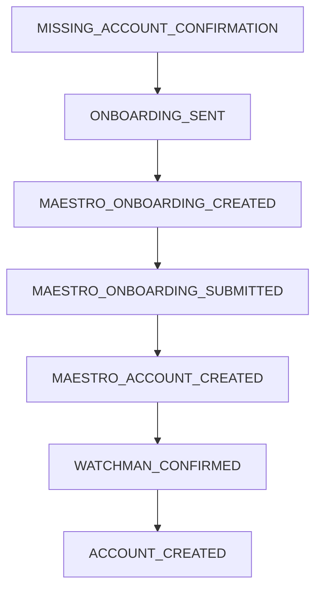

# Sistema de Webhooks e Notificações - Visão Unificada

Este documento descreve o funcionamento completo do sistema de webhooks e notificações no ecossistema, desde a configuração de webhooks pelos partners até o processamento de notificações de eventos do onboarding, passando pela integração entre os sistemas Assemble, Maestro e Watchman.

## Visão Geral

O sistema de webhooks e notificações é responsável por:

- **Configuração de Webhooks**: Partners podem configurar endpoints para receber notificações
- **Processamento de Eventos**: Eventos de onboarding são processados e transformados em notificações
- **Integração entre Sistemas**: Coordenação entre Assemble (Gateway), Maestro (Core) e Watchman (KYC)
- **Notificação de Partners**: Envio de webhooks para endpoints configurados pelos partners

O fluxo garante **rastreabilidade**, **confiabilidade** e **observabilidade** através de logs estruturados, tratamento de erros e processamento assíncrono.

## Arquitetura do Fluxo

```
Watchman (KYC) → Assemble (Gateway) → Partner Webhook
       ↑                ↓
   Eventos KYC    Processamento
                      ↓
                  Maestro (Core)
                      ↓
                 Elasticsearch
```

## Componentes Principais

### 1. Sistema de Webhooks (`WebhooksOnboardingModule`)

#### 1.1 Configuração de Webhooks (`WebhooksOnboardingController`)

**Endpoint**: `PUT /webhooks/business-partners/mine`

- Permite partners configurar/atualizar seus webhooks
- Autenticação via `PartnerApiKeyGuard`
- Valida dados do webhook (`WebhookUpsertDto`)
- Retorna configuração de callback (`WebhookCallbackDto`)

#### 1.2 Gerenciamento de Webhooks (`WebhooksOnboardingService`)

**Responsabilidades**:

- **Upsert de Webhooks**: Cria ou atualiza configuração do partner
- **Notificação de Partners**: Executa chamadas HTTP para endpoints configurados
- **Persistência**: Gerencia registros na tabela `business_partner_webhook`

**Estrutura de Dados**:

```typescript
{
  id: string;
  url: string;                    // Endpoint do partner
  verb: 'GET' | 'POST';          // Método HTTP
  headers?: Record<string, string>; // Headers customizados
  partnerId: string;             // ID do partner
}
```

### 2. Sistema de Notificações (`NotificationsModule`)

#### 2.1 Recepção de Eventos (`NotificationsController`)

**Endpoint**: `POST /notifications/onboarding`

- Recebe notificações do sistema Watchman
- Autenticação via `ApiKeyNotificationGuard`
- Processa eventos de onboarding (`OnboardingNotificationDto`)
- Retorna `202 ACCEPTED` para processamento assíncrono

#### 2.2 Processamento de Eventos (`NotificationsService`)

**Categorias de Eventos**:

- **CUSTOMER Events**: Eventos relacionados ao status do cliente
- **DOCUMENT Events**: Eventos relacionados à análise de documentos

**Fluxo de Processamento**:

1. Identificação do partner via `partner_id_watchman`
2. Classificação do evento por prefixo (`CUSTOMER_*`, `DOCUMENT_*`)
3. Busca do usuário bancário relacionado
4. Processamento específico por tipo de evento
5. Integração com Maestro para operações bancárias
6. Notificação do partner via webhook

## Fluxo Detalhado de Ponta a Ponta

### Fase 1: Configuração de Webhook (Partner → Assemble)

#### 1.1 Solicitação de Configuração

**Requisição do Partner**:

```http
PUT /webhooks/business-partners/mine
X-API-Key: encrypted_partner_key
Content-Type: application/json

{
  "url": "https://partner.com/webhooks/onboarding",
  "verb": "POST",
  "headers": {
    "Authorization": "Bearer partner_token",
    "X-Partner-ID": "partner_123"
  }
}
```

#### 1.2 Processamento no Assemble

**Validações**:

- Autenticação do partner via `PartnerApiKeyGuard`
- Descriptografia da API key usando `AesService`
- Validação do payload (`WebhookUpsertDto`)

**Persistência**:

```sql
-- Se não existe webhook para o partner
INSERT INTO business_partner_webhook (
  id, partner_id, url, verb, headers, created_at, updated_at
) VALUES (?, ?, ?, ?, ?, ?, ?)

-- Se já existe webhook para o partner
UPDATE business_partner_webhook
SET url = ?, verb = ?, headers = ?, updated_at = ?
WHERE partner_id = ?
```

### Fase 2: Evento de Onboarding (Watchman → Assemble)

#### 2.1 Geração de Evento no Watchman

**Cenários de Eventos**:

- **CUSTOMER_STATUS_CHANGED**: Mudança de status do cliente
- **CUSTOMER_APPROVED**: Cliente aprovado no KYC
- **CUSTOMER_REJECTED**: Cliente rejeitado no KYC
- **DOCUMENT_ANALYZED**: Documento analisado
- **DOCUMENT_APPROVED**: Documento aprovado
- **DOCUMENT_REJECTED**: Documento rejeitado

#### 2.2 Chamada para Assemble

**Requisição do Watchman**:

```http
POST /notifications/onboarding
X-API-Key: watchman_notification_key
Content-Type: application/json

{
  "partnerId": "partner_watchman_id",
  "eventName": "CUSTOMER_APPROVED",
  "data": {
    "id": "bank_user_uuid",
    "status": "MISSING_ACCOUNT_CONFIRMATION",
    "customerId": "external_customer_id"
  }
}
```

### Fase 3: Processamento de Notificação (Assemble)

#### 3.1 Validação e Roteamento (`NotificationsService`)

**Validações Iniciais**:

```typescript
// Busca partner por partner_id_watchman
const partner = await this.businessPartnersService.findOneByParterIdWatchman(
  notification.partnerId,
);

// Classifica evento por prefixo
const eventPrefix = notification.eventName.split('_')[0]?.toLocaleUpperCase();

// Roteia para handler específico
switch (eventPrefix) {
  case EventPrefix.CUSTOMER:
    return await this.handleCustomerEvent(partner, notification);
  case EventPrefix.DOCUMENT:
    return await this.handleDocumentEvent(partner, notification);
}
```

#### 3.2 Processamento de Evento de Cliente

**Fluxo para CUSTOMER Events**:

1. **Busca do Usuário Bancário**:

   ```typescript
   const user = await this.bankUserService.findOneByUserId(
     notification.data.id,
   );
   ```

2. **Determinação do Fluxo**:

   - Eventos de status → `openAccount()`
   - Eventos de documento → processamento específico

3. **Integração com Maestro**:

   ```typescript
   // Busca onboarding no Maestro
   const onboarding = await this.maestroService.retrieveOnboarding(
     user.externalId,
     partner,
   );

   // Cria onboarding se necessário
   if (!onboarding) {
     await this.maestroService.createOnboarding(user, partner, customerType);
   }
   ```

#### 3.3 Fluxo de Abertura de Conta (`openAccount`)

**Estados do Onboarding**:

- `MISSING_ACCOUNT_CONFIRMATION`: Aguardando confirmação
- `ONBOARDING_SENT`: Onboarding enviado
- `MAESTRO_ONBOARDING_CREATED`: Onboarding criado no Maestro
- `MAESTRO_ONBOARDING_SUBMITTED`: Onboarding submetido no Maestro
- `MAESTRO_ACCOUNT_CREATED`: Conta criada no Maestro
- `WATCHMAN_CONFIRMED`: Confirmado no Watchman
- `ACCOUNT_CREATED`: Conta finalizada

**Processamento por Estado**:

1. **MISSING_ACCOUNT_CONFIRMATION → ONBOARDING_SENT**:

   ```typescript
   await this.maestroService.createOnboarding(user, partner, customerType);
   await this.onboardingProcessesService.setOnboardingProcess(
     partner.id,
     user.userId,
     'ONBOARDING_SENT',
     steps,
   );
   ```

2. **MAESTRO_ONBOARDING_CREATED → MAESTRO_ONBOARDING_SUBMITTED**:

   ```typescript
   // Verifica se onboarding está completo e aprovado
   if (
     onboarding.data.status === 'COMPLETE' &&
     onboarding.data.customer.kycStatus === 'APPROVED'
   ) {
     await this.maestroService.submitOnboarding(user, partner);
   }
   ```

3. **MAESTRO_ONBOARDING_SUBMITTED → MAESTRO_ACCOUNT_CREATED**:

   ```typescript
   const account = await this.maestroService.createAccount(user, partner);
   ```

4. **MAESTRO_ACCOUNT_CREATED → WATCHMAN_CONFIRMED**:

   ```typescript
   await this.watchmanService.confirmOnboarding(
     partner,
     user.userId,
     user.externalId,
     customerType,
   );
   ```

5. **WATCHMAN_CONFIRMED → ACCOUNT_CREATED**:
   ```typescript
   await this.onboardingProcessesService.setOnboardingProcess(
     partner.id,
     user.userId,
     'ACCOUNT_CREATED',
     null,
   );
   ```

### Fase 4: Notificação do Partner (Assemble → Partner)

#### 4.1 Construção do Payload

**Estrutura do Webhook**:

```typescript
const webhookPayload = {
  eventType: notification.eventName,
  customerId: user.externalId,
  userId: user.userId,
  status: currentStatus,
  timestamp: new Date().toISOString(),
  data: {
    onboardingStep: steps,
    accountInfo: account?.data,
    kycStatus: onboarding?.data?.customer?.kycStatus,
  },
};
```

#### 4.2 Execução do Webhook (`WebhooksOnboardingService.notify`)

**Processo de Notificação**:

1. **Busca da Configuração**:

   ```typescript
   const webhook = await this.findByPartnerId(partnerInfo.id);
   if (!webhook) {
     this.logger.warn(`Partner ${partnerInfo.id} has not webhook configured`);
     return;
   }
   ```

2. **Execução da Chamada HTTP**:

   ```typescript
   const { url, verb, headers = {} } = webhook;

   switch (verb) {
     case 'POST':
       await this.httpClientService.post(url, webhookPayload, { headers });
       break;
     case 'GET':
       await this.httpClientService.get(url, {
         headers,
         params: webhookPayload,
       });
       break;
   }
   ```

3. **Tratamento de Erros**:
   ```typescript
   try {
     // Execução do webhook
   } catch (error) {
     this.logger.error(
       error,
       'Partner: %s - Erro ao notificar webhook',
       partnerInfo.id,
     );
     // Não propaga erro para não falhar o processamento principal
   }
   ```

## Integrações Externas

### 1. Sistema Maestro (Core Bancário)

#### 1.1 Endpoints Utilizados

**Onboarding**:

- `GET /Onboardings/{customerId}` - Buscar onboarding
- `POST /Onboardings` - Criar onboarding
- `POST /Onboardings/{customerId}/Submit` - Submeter onboarding

**Contas Bancárias**:

- `POST /Br/BankAccounts/{uuid}` - Criar conta
- `GET /Br/BankAccounts/{customerId}` - Buscar conta

#### 1.2 Autenticação

**Basic Auth**:

```typescript
const headers = {
  'Content-Type': 'application/json',
  Authorization: generateBasicAuthHeader(client_id, client_secret),
};
```

**Credenciais por Partner**:

```json
{
  "credentials_maestro": {
    "client_id": "partner_maestro_id",
    "client_secret": "partner_maestro_secret"
  }
}
```

### 2. Sistema Watchman (KYC)

#### 2.1 Endpoints Utilizados

**Onboarding**:

- `GET /customers/{type}/{customerId}` - Buscar onboarding
- `PUT /customers/{type}/{taxpayer}/{bankUserId}` - Atualizar onboarding
- `POST /customers/{type}/send-or-validate/{userUuid}` - Validar/Enviar
- `POST /customers/{type}/confirm/{userId}` - Confirmar onboarding

**Análise de Documentos**:

- `PUT /document-analysis/upload` - Upload de documento

#### 2.2 Autenticação

**Basic Auth + Partner ID**:

```typescript
const headers = {
  'Content-Type': 'application/json',
  'x-partner-id': partnerIdWatchman,
  Authorization: generateBasicAuthHeader(watchmanKey, watchmanSecret),
};
```

## Estrutura do Banco de Dados

### Tabelas de Webhooks

#### `business_partner_webhook`

```sql
CREATE TABLE business_partner_webhook (
  id CHAR(36) PRIMARY KEY,
  partner_id CHAR(36) NOT NULL,
  url VARCHAR(500) NOT NULL,
  verb ENUM('GET', 'POST') NOT NULL,
  headers JSON,
  created_at TIMESTAMP DEFAULT CURRENT_TIMESTAMP,
  updated_at TIMESTAMP DEFAULT CURRENT_TIMESTAMP ON UPDATE CURRENT_TIMESTAMP,
  deleted_at TIMESTAMP NULL,

  FOREIGN KEY (partner_id) REFERENCES business_partners(id),
  UNIQUE KEY unique_partner_webhook (partner_id, deleted_at)
);
```

### Tabelas de Onboarding

#### `onboarding_process`

```sql
CREATE TABLE onboarding_process (
  id CHAR(36) PRIMARY KEY,
  user_id CHAR(36) NOT NULL,
  partner_id CHAR(36) NOT NULL,
  uuid CHAR(36) NOT NULL,
  status VARCHAR(50),
  event_name VARCHAR(100),
  created_at TIMESTAMP DEFAULT CURRENT_TIMESTAMP,
  updated_at TIMESTAMP DEFAULT CURRENT_TIMESTAMP ON UPDATE CURRENT_TIMESTAMP,
  deleted_at TIMESTAMP NULL,

  FOREIGN KEY (user_id) REFERENCES bank_users(id),
  FOREIGN KEY (partner_id) REFERENCES business_partners(id)
);
```

#### `business_partners`

```sql
CREATE TABLE business_partners (
  id CHAR(36) PRIMARY KEY,
  name VARCHAR(255) UNIQUE NOT NULL,
  external_id_maestro VARCHAR(255),
  partner_id_watchman VARCHAR(255),
  credentials_maestro JSON,
  created_at TIMESTAMP DEFAULT CURRENT_TIMESTAMP,
  updated_at TIMESTAMP DEFAULT CURRENT_TIMESTAMP ON UPDATE CURRENT_TIMESTAMP,
  deleted_at TIMESTAMP NULL
);
```

## Tipos de Eventos Suportados

### Customer Events

| Evento                    | Descrição                 | Ação                         |
| ------------------------- | ------------------------- | ---------------------------- |
| `CUSTOMER_APPROVED`       | Cliente aprovado no KYC   | Abertura de conta            |
| `CUSTOMER_REJECTED`       | Cliente rejeitado no KYC  | Notificação de rejeição      |
| `CUSTOMER_STATUS_CHANGED` | Mudança de status         | Processamento do novo status |
| `CUSTOMER_PENDING_REVIEW` | Cliente em análise manual | Notificação de pendência     |

### Document Events

| Evento                    | Descrição            | Ação                          |
| ------------------------- | -------------------- | ----------------------------- |
| `DOCUMENT_ANALYZED`       | Documento analisado  | Atualização de status         |
| `DOCUMENT_APPROVED`       | Documento aprovado   | Progressão do onboarding      |
| `DOCUMENT_REJECTED`       | Documento rejeitado  | Solicitação de novo documento |
| `DOCUMENT_PENDING_REVIEW` | Documento em análise | Notificação de pendência      |

## Estados do Onboarding

### Fluxo Principal



### Estados de Erro

- `MAESTRO_ERROR`: Erro na integração com Maestro
- `WATCHMAN_ERROR`: Erro na integração com Watchman
- `VALIDATION_ERROR`: Erro de validação de dados
- `WEBHOOK_ERROR`: Erro no envio de webhook (não bloqueia o fluxo)

## Observabilidade e Monitoramento

### Logs Estruturados

**Configuração de Webhook**:

```json
{
  "level": "info",
  "message": "Webhook configured",
  "partnerId": "partner_123",
  "url": "https://partner.com/webhook",
  "verb": "POST"
}
```

**Processamento de Evento**:

```json
{
  "level": "info",
  "message": "Processing onboarding event",
  "eventName": "CUSTOMER_APPROVED",
  "partnerId": "partner_123",
  "userId": "user_456",
  "currentStep": "MAESTRO_ONBOARDING_CREATED"
}
```

**Execução de Webhook**:

```json
{
  "level": "info",
  "message": "Webhook executed successfully",
  "partnerId": "partner_123",
  "url": "https://partner.com/webhook",
  "statusCode": 200,
  "responseTime": "150ms"
}
```

### Tratamento de Erros

**Estratégias de Resilência**:

- Webhooks não bloqueiam o fluxo principal
- Retry automático para integrações críticas (Maestro/Watchman)
- Dead letter queue para eventos falhados
- Circuit breaker para sistemas externos

**Alertas e Métricas**:

- Taxa de sucesso de webhooks por partner
- Latência de processamento de eventos
- Disponibilidade de sistemas externos
- Volume de eventos por tipo/partner
